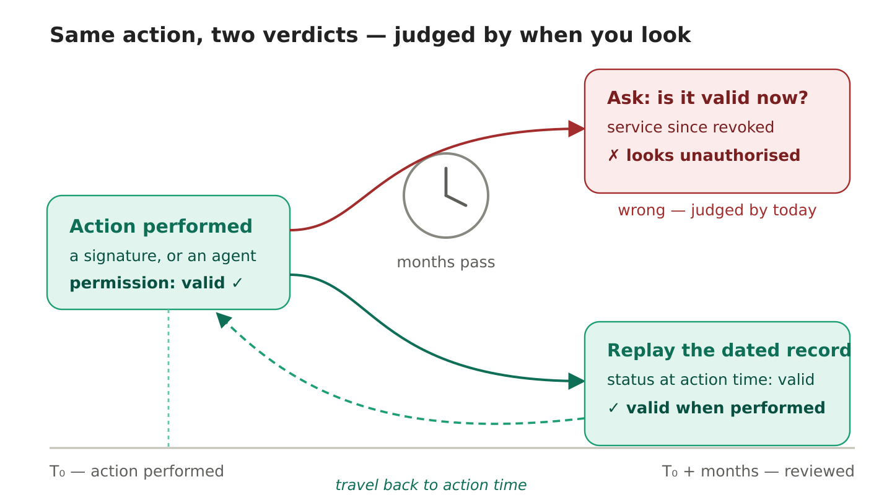
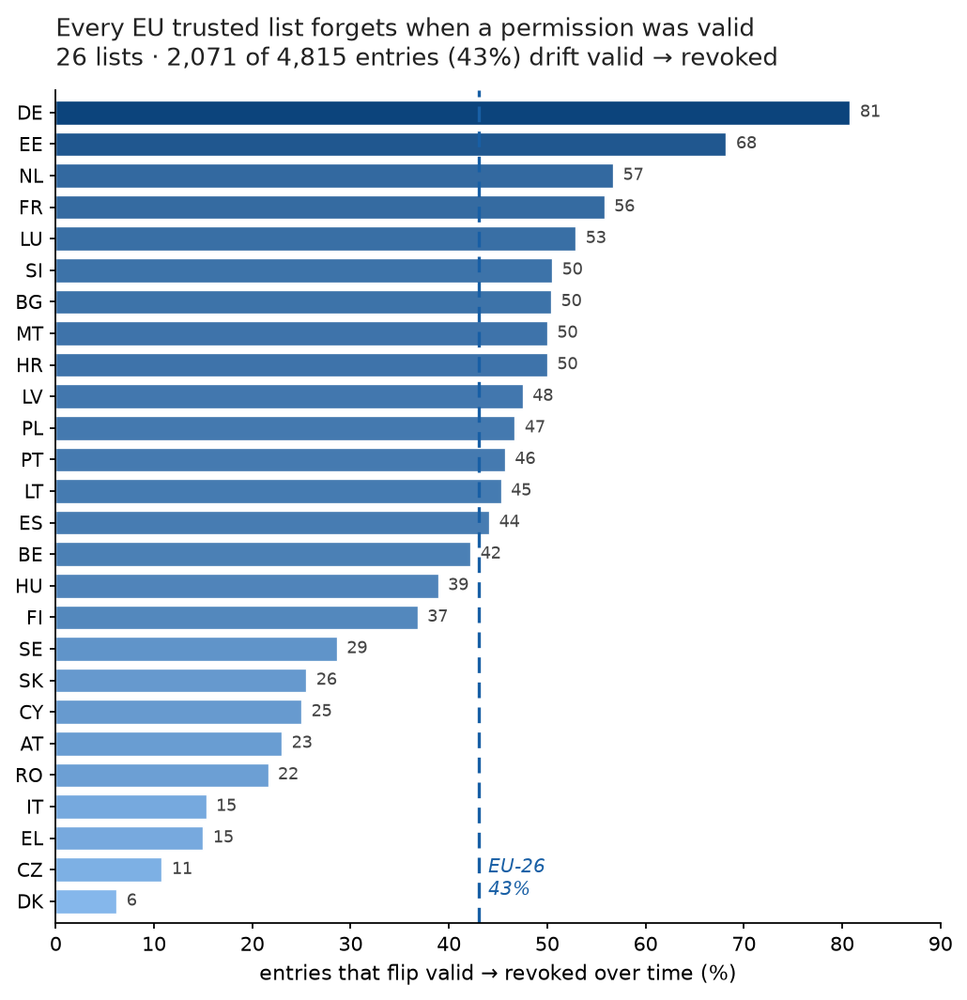

# Action-Time versus Review-Time Authorization Status across the EU Trusted Lists
### The Time-Travel Evidence Lab — preprint

**Anton Sokolov** — Tyche Institute, Tallinn, Estonia — ORCID [0000-0003-2452-7096](https://orcid.org/0000-0003-2452-7096)

> Preprint (2026). Under review at the *Journal of Information Security and Applications* (Elsevier). This is the author's version; the published version, once available, is the version of record.

**[📄 Read the paper (PDF)](paper/time-travel-evidence-lab.pdf)**

---

## In one line

When a past digital action is reviewed, systems ask *"is this valid **now**?"* — but the fair question is *"was it valid **when it happened**?"*. These are two different facts, and the gap between them runs right across the EU's trust infrastructure.



## The problem, in plain terms

You sign something today; it is valid. Months later a reviewer re-checks it by asking whether the permission is valid *now* — but the trust service behind it has since been revoked or retired. The action was lawful when performed, yet it now reads as unauthorised, for reasons that have nothing to do with the action itself. Most evidence-checking mechanisms — status lists, token introspection, trusted lists, timestamps, logs — answer a single present-time query and quietly conflate two dated facts: status at *action time* and status at *review time*.

## The measurement

We replayed this check over the European Union's own official **trusted lists** — the public registers behind qualified electronic signatures — for every member state reachable from the EU List of Trusted Lists.

- **2,071 of 4,815** trust-service entries (**43%**) record a *valid → revoked* transition over time.
- **Every one of the 26** member-state lists is affected — from **6%** (Denmark) to **81%** (Germany).
- The effect does not depend on AI, or on how large a list is — it is **structural**.



Two further controlled experiments show the same split one layer up, at the delegated-mandate level that no public list records, and that a later reviewer must preserve the **dated dependency closure** around a record, not the signed record alone.

## The fix

Preserve a small, signed, **dated snapshot of what was true at action time** (a *mandate-status statement*) and **replay** it later, instead of re-asking a live system that has moved on. Trust is not removed — it is relocated to a named, accountable, checkable record.

## Reproduce the census

```bash
python3 census/eu_tl_census.py --json
```

`census/eu-census.json` holds the per-country counts and the SHA-256 of each list; `census/census-provenance.json` records the source URL and fetch date of every member-state Trusted List. The raw list files (ETSI TS 119 612 XML) are archived separately on Zenodo.

## Figures

- `figures/eu-census.pdf` — per-country drift, and the drift-vs-list-size check (paper Figure 1)
- `figures/delegation-drift.pdf` — one fixed action, two verdict tracks over review time (paper Figure 2)
- `figures/time-travel-concept.*`, `figures/eu-census-keepsake.svg` — illustrative

## Cite

```bibtex
@misc{sokolov2026timetravel,
  author = {Sokolov, Anton},
  title  = {Action-Time versus Review-Time Authorization Status across the EU Trusted Lists: The Time-Travel Evidence Lab},
  year   = {2026},
  note   = {Preprint; under review at the Journal of Information Security and Applications},
  url    = {https://github.com/tyche-institute/time-travel-evidence-lab}
}
```

## License

Paper text and figures: **CC BY 4.0**. Code (`census/`): **MIT**. See `LICENSE`.
